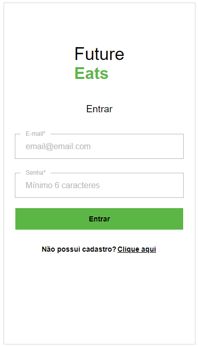
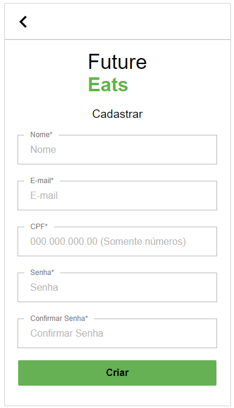
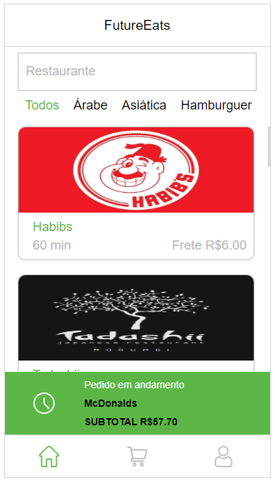
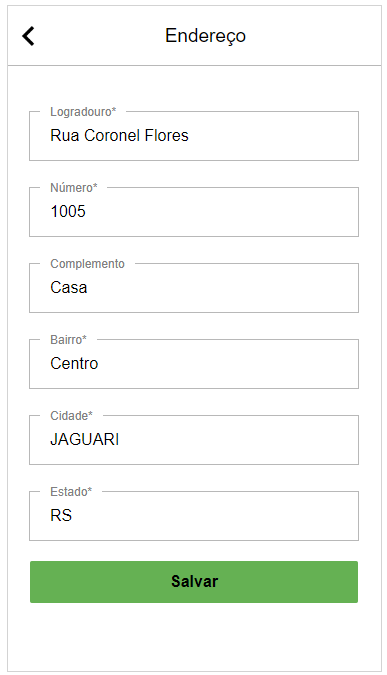

# `Projeto`
Projeto LabeFoods

# `Link`
[Clique aqui!](https://labefoods-alves5.surge.sh)

# `Descrição`
O Projeto LabeFoods foi desenvolvido como projeto final de Front End dentro do curso Full-Stack Web Developer da Labenu, o qual consiste em requisições (via axios) para a API labeFoods, que contém informações relacionadas ao desenvolvimento de uma aplicação que simula um aplicativo semelhante ao conhecido app iFood. Este projeto foi baseado no layout layout FutureEats.  
Neste projeto foi utilizado o conceito de "Mobile Firts", onde o projeto foi desenvolvido pensando primeiramente na utilização por aparelhos celulares.  
As requisições para a API utilizadas neste projeto foram:  
**[POST] Login**: endpoint utilizado para fazer login de usuário já cadastrado.  
**[POST] Signup**: endpoint utilizado para fazer o cadastro de novos usuários.  
**[PUT] Add Adress**: endpoint utilizado para realizar o cadastro ou a edição do endereço de um usuário.  
**[GET] Get Full Address**: endpoint utilizado para retornar as informações separados do endereço do usuário.  
**[GET] Get Profile**: endpoint utilizado para retonar as informações do usuário.  
**[PUT] Update Profile**: endpoint utilizado para atualizar as informações de um usuário.  
**[GET] Get Restaurants**: endpoint que retorna uma lista de todos os restaurantes.  
**[GET] Get Restaurant Detail**: endpoint que retorna os detalhes de um restaurante e uma lista de produtos deste.  
**[POST] Place Order**: endpoint utilizado para realizar um pedido, recebendo um array de produtos e método de pagamento.  
**[GET] Get Active Order**: endpoint que retorna o pedido ativo do usuário.  
**[GET] Orders History**: endpoint utilizado para retornar uma lista de todos os pedidos que foram finalizados.  

A documentação da API pode ser encontrada [aqui](https://documenter.getpostman.com/view/7549981/SWTEdGtT).

# `Modo de usar`
Ao iniciar a aplicação o usuário é direcionado para a tela de Login. Nesta tela, o usuário pode efetuar seu login ou então se inscrever na plataforma, criando um usuário com nome, email, senha e dados de endereço.
 
Após efetuar login, o usuário é redirecionado para a página de feed, onde poderá escolher entre diferentes tipos de restaurantes, podendo filtrar por palavras chave (utilizando para o tal o campo de buscas) ou por tipos de comidas, na barra superior. Dentre as opções estão, por exemplo, comida Asiática, Hamburgueres, Italiana, Sorvetes entre outras.
 
Clicando sobre a imagem de um restaurante no feed, o usuário é redicionado para a página de detalhes. Nesta página é mostrada a imagem do restaurante e algumas informações, como por exemplo o endereço. Abaixo são listados todos os produtos oferecidos pelo estabelecimento, com informações de nome, descrição e preço. Ao clicar em "adicionar" é aberta uma janela para a escolha da quantidade. Após adicionar ao carrinho, o ícone passa a exibir o texto "remover" e na parte superior do card aparece a quantidade deste ítem que está inserida no carrinho.
 
Na parte inferior da página existe um menu, onde o usuário pode acessar a página de carrinho e verificar todos os itens que adicionou ao mesmo, valor do frente e total da compra, além de selecionar um método de pagamento. Também é possível remover itens da lista. Ao clicar em confirmar, será exibida uma mensagem de pedido realizado com sucesso.
 
No menu inferior, o usuário pode clicar no ícone de perfil e então será redirecionado para a página de perfil do usuário. Nesta página são carregados os dados do usuário logado. Existe a opção de alterar os dados de cadastro e de endereço, bastando para tal clicar no ícone de edição. Ao clicar em editar, o usuário é redirecionado para as páginas de edição, onde são mostrados os formulário já contendo seus dados de cadastro originais e editáveis, onde o usuário pode fazer as modificações que desejar. Também é mostrado o histórico de pedidos, onde é exibida uma lista contendo as informações do nome do restaurante, a data da compra e o total gasto. No canto superior direito da página, é mostrada uma mensagem "Olá, nome-do-usuário" e um ícone onde é possível fazer o logout da conta, sendo então redirecionado para a página de login.

# `Instalando e rodando o projeto`
Fazer o clone do projeto:
- git clone link-do-repositório

Instalar as dependências:
- npm install

Rodar o projeto:
- npm run start

# `Tecnologias utilizadas`

# `Autores`
Evandro Paulo Folletto  
José Robinaldo Ramos da Silva  
Leonardo José Silva Lopes de Souza  
Márleo Piber da Rosa  
Olavo Marques do Nascimento

# `Imagens`
### Página Login

### Página SignUp (Cadastro)

### Página Feed

### Página detalhes

### Página Carrinho

### Página Perfil

### Página Editar perfil

### Página Editar Endereço

